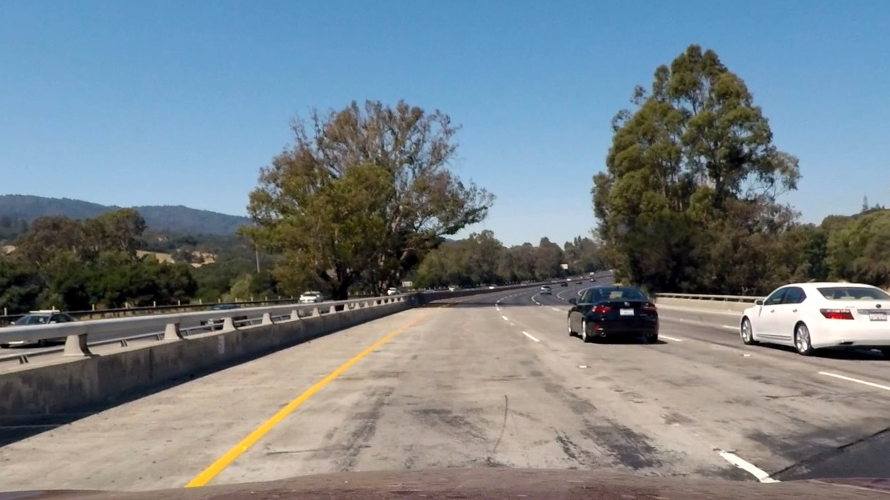

## Writeup 

---


**Advanced Lane Finding Project**

The goals / steps of this project are the following:

* Compute the camera calibration matrix and distortion coefficients given a set of chessboard images.
* Apply a distortion correction to raw images.
* Use color transforms, gradients, etc., to create a thresholded binary image.
* Apply a perspective transform to rectify binary image ("birds-eye view").
* Detect lane pixels and fit to find the lane boundary.
* Determine the curvature of the lane and vehicle position with respect to center.
* Warp the detected lane boundaries back onto the original image.
* Output visual display of the lane boundaries and numerical estimation of lane curvature and vehicle position.


## [Rubric](https://review.udacity.com/#!/rubrics/571/view) Points

### Here I will consider the rubric points individually and describe how I addressed each point in my implementation.  

---

### Writeup / README

#### 1. Provide a Writeup / README that includes all the rubric points and how you addressed each one.  You can submit your writeup as markdown or pdf.  [Here](https://github.com/udacity/CarND-Advanced-Lane-Lines/blob/master/writeup_template.md) is a template writeup for this project you can use as a guide and a starting point.  

You're reading it!

### Camera Calibration

#### 1. Briefly state how you computed the camera matrix and distortion coefficients. Provide an example of a distortion corrected calibration image.

The code for this step is contained in the first code cell of the IPython notebook located in "./camera_cal/cam_cal.ipynb". 

I start by preparing "object points", which will be the (x, y, z) coordinates of the chessboard corners in the world. Here I am assuming the chessboard is fixed on the (x, y) plane at z=0, such that the object points are the same for each calibration image.  Thus, `objp` is just a replicated array of coordinates, and `objpoints` will be appended with a copy of it every time I successfully detect all chessboard corners in a test image.  `imgpoints` will be appended with the (x, y) pixel position of each of the corners in the image plane with each successful chessboard detection.  

I then used the output `objpoints` and `imgpoints` to compute the camera calibration and distortion coefficients using the `cv2.calibrateCamera()` function.  I applied this distortion correction to the test image using the `cv2.undistort()` function and obtained this result: 


### Pipeline (single images)

#### 1. Provide an example of a distortion-corrected image.

To demonstrate this step, I will describe how I apply the distortion correction to one of the test images like this one:

distorted_img = cv2.imread('./test_images/test1.jpg')
undistorted_img= cv2.undistort(distorted_img, mtx, dist, None, mtx)
cv2.imwrite('./output_images/undistorted.jpg', undistorted_img)
I used the cv2.undistort function with camera matrix and distortion coefficients I calculated on chessboard images.
Here is the result image 

#### 2. Describe how (and identify where in your code) you used color transforms, gradients or other methods to create a thresholded binary image.  Provide an example of a binary image result.

I used a combined horizontal in conjunction with vertical gradient, s channel from a hls color space in conjunction with v channel from a hsv color space. I combined both thresholds with disjunction. Code for this step is located at lines 57 through 64 in `utilities.py`).  Here's an example of my output for this step.  


#### 3. Describe how (and identify where in your code) you performed a perspective transform and provide an example of a transformed image.

The code for my perspective transform includes a function called `calc_perspective()`, which appears in lines 66 through 89 in the file `utilities.py`. The `warper()` function takes as inputs an image (`img`), and calculate the perspective images with  source (`src`) and destination (`dst`) points as parameters.  I chose to hardcode the source and destination points in the following manner:

```python
src = np.float32([
        [img_size[0]*.54, img_size[1]*0.62],
        [img_size[0]*0.87,img_size[1]],
        [img_size[0]*0.14,img_size[1]],
        [img_size[0]*0.46,img_size[1]*0.62]])

offset = img_size[0] * 0.23
dst = np.float32([[img_size[0]-offset, 0],[img_size[0]-offset, img_size[1]],
                      [offset, img_size[1]],[offset, 0]])
```

This resulted in the following source and destination points:


| Source        | Destination   | 
|:-------------:|:-------------:| 
| 691.2  446.4  | 985.6   0     | 
| 1113.6 720    | 985.6 720     |
| 179.2  720    | 294.4 720.    |
| 588.8  446.4  | 294.4   0.    |

I verified that my perspective transform was working as expected by drawing the `src` and `dst` points onto a test image and its warped counterpart to verify that the lines appear parallel in the warped image.


#### 4. Describe how (and identify where in your code) you identified lane-line pixels and fit their positions with a polynomial?
The code for this step is located at lines 155 to 238 of utilities.py 
I applied a histogram to identify the peaks across x-axis, this is where I start my lane search from the bottom of the image. Then I used sliding windows technique to gradually follow the lanes forward.
All following frames will search for new lane withing some range of previous lane. If something went wrong I recalculate the lane like the first time.


#### 5. Describe how (and identify where in your code) you calculated the radius of curvature of the lane and the position of the vehicle with respect to center.

I did this in lines 240 through 277 in my code in `utilities.py`
I found cars relative position, assuming that car's center is in the center of the image, then I calculated lane bottom positions and found the lanes center. Comparing lanes center to cars position I was able to calculate the cars relative position.
For finding curve radius I converted pixel to meters, then made a polinomial fit. I also computed average of two curves.


#### 6. Provide an example image of your result plotted back down onto the road such that the lane area is identified clearly.

I implemented this step in lines 280 through 298 in my code in `utilities.py`.  Here is an example of my result on a test image:


---

### Pipeline (video)

#### 1. Provide a link to your final video output.  Your pipeline should perform reasonably well on the entire project video (wobbly lines are ok but no catastrophic failures that would cause the car to drive off the road!).

Here's a [link to my video result](./output1_tracked.mp4)


---

### Discussion

#### 1. Briefly discuss any problems / issues you faced in your implementation of this project.  Where will your pipeline likely fail?  What could you do to make it more robust?

In this project I realized that it is very important to make a measurement of your progress fast and simple this way you can  quickly try different approaches and tweek parameters, finding the best ones quick. Applying different trasformations to images and putting them near make it easier to spot slight changes. It is very important to understand what your code is doing, but unfortunately I don't know to debug jupyter notebooks effectively.

